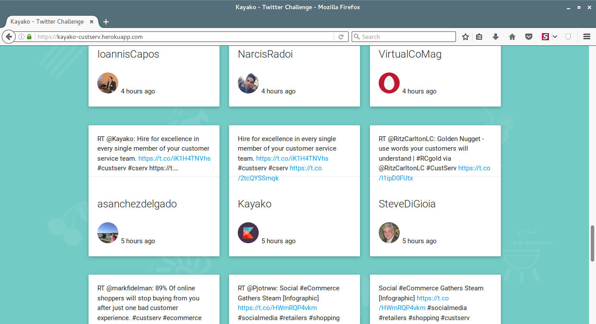
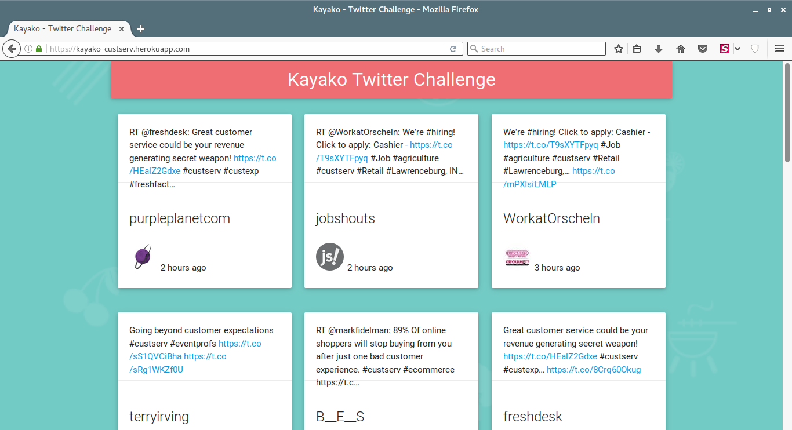

# kayako-custserv

> View all tweets with #custserv and RT count >=1.

### Instructions :

- Clone this repository using `git clone https://github.com/mr-karan/kayako-cust-serv.git`
- `cd kayako-cust-serv`
- Create virtual env using `python3 -m venv venv` or `virtualenv` if on Python2.
- Activate virtual env `source venv/bin/activate` and install requirements using `pip install requirements.txt`  
- Create a new app at https://apps.twitter.com/app/new and export token in your `.bashrc` or `.zshrc` or any shell you use. Check `config.py` for more info.
- `python app.py`
- Visit `http://localhost:8000`

### See it in action:

### License
> MIT © Karan Sharma

> [LICENSE included here](LICENSE)
